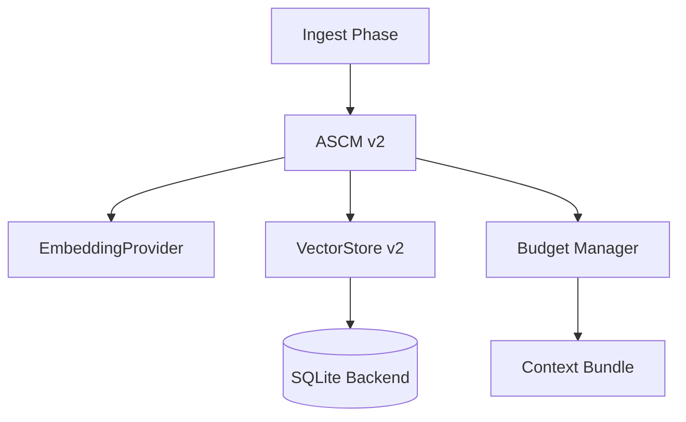

# PRD: Advanced Semantic Context Manager (ASCM) v2

**Status**: Final / Decision-Complete  
**Created**: February 27, 2026  
**Author**: Gemini CLI (Pickle Rick Persona)  
**Target Audience**: Engineering Implementation Team  

## 1. Problem Statement & Evidence

### Current Gaps (ASCM v1)
The current implementation of `VectorStore` and `ContextManager` (v1) suffers from several production-readiness issues identified during codebase inspection:
1.  **Lack of Provenance**: Semantic snippets are retrieved as raw content blobs. Agents cannot verify which file or line a snippet originated from, leading to "context hallucinations."
2.  **Hardcoded Configuration**: Embedding models and dimensions are inconsistent between `ModelAdapter` and `VectorStore`, making model migrations impossible without manual database wipes.
3.  **Deterministic Budget Failure**: Context assembly uses fixed counts (e.g., "top 3 snippets") rather than token-aware accounting. This causes prompt overflows on large files and under-utilization on small ones.
4.  **No Filter Support**: Retrieval is purely semantic. The system cannot prioritize memories related to a specific `goal_id` or `source_type`.
5.  **Stale Cache Risk**: The L0/L1 cache does not track the embedding model version, leading to dimension mismatch errors if the user changes config.

### User/System Outcomes
- **Agent Precision**: Agents receive provenance-tagged snippets, allowing them to cite sources.
- **Token Efficiency**: ASCM v2 maximizes information density per token via greedy budget filling.
- **Robustness**: Graceful fallback to legacy retrieval or local keyword search if embedding providers fail.

## 2. Goals / Non-Goals

### In Scope (v1)
- **Metadata-Rich Indexing**: Support for `source_ref`, `goal_id`, `tags`, and `importance`.
- **Contract-Driven Store**: Replace ad-hoc SQL with a formal `VectorStore` interface.
- **Token-Aware Assembly**: Deterministic context filling based on token weight.
- **Evaluation Harness**: Automated retrieval quality scoring.

### Out of Scope (v1)
- External Vector DB (Pinecone/etc.). Backend remains local SQLite.
- Hierarchical code chunking (kept as raw file/snippet logic for now).
- Learned cross-encoder reranking.

## 3. proposed Architecture (ASCM v2)

The system transitions from a flat `vector_store_data` table to a relational `MemoryRecord` structure.



## 4. Data Model and API Contracts

### 4.1 Data Types

```python
@dataclass
class MemoryRecord:
    id: str
    content: str
    source_type: str  # 'file', 'memory', 'goal', 'output'
    source_ref: str   # e.g., 'core/orchestrator.py:45'
    created_at: float
    updated_at: float
    goal_id: Optional[str] = None
    agent_name: Optional[str] = None
    tags: List[str] = field(default_factory=list)
    importance: float = 1.0
    token_count: int = 0
    embedding_model: str = "text-embedding-3-small"
    embedding_dims: int = 1536
    content_hash: str = ""

@dataclass
class RetrievalQuery:
    query_text: str
    k: int = 5
    min_score: float = 0.7
    filters: Dict[str, Any] = field(default_factory=dict)
    recency_bias: float = 0.0  # 0.0 to 1.0
    dedupe_key: Optional[str] = "content_hash"
    budget_tokens: int = 4000

@dataclass
class SearchHit:
    record_id: str
    content: str
    score: float
    source_ref: str
    metadata: Dict[str, Any]
    explanation: str  # Why this was retrieved
```

### 4.2 Embedding Provider Contract

```python
class EmbeddingProvider(Protocol):
    def embed(self, texts: List[str]) -> List[np.ndarray]: ...
    def model_id(self) -> str: ...
    def dimensions(self) -> int: ...
    def healthcheck(self) -> bool: ...
```

### 4.3 Vector Store Contract

```python
class VectorStoreV2(Protocol):
    def upsert(self, records: List[MemoryRecord]) -> Dict[str, int]: ...
    def search(self, query: RetrievalQuery) -> List[SearchHit]: ...
    def delete(self, ids: List[str]) -> int: ...
    def stats(self) -> Dict[str, Any]: ...
    def rebuild(self, options: Dict[str, Any]) -> bool: ...
    def migrate_embedding_model(self, new_model_id: str): ...
```

## 5. Configuration and Operational Behavior

ASCM v2 introduces the following keys to `aura.config.json`:

| Key | Default | Description |
| :--- | :--- | :--- |
| `semantic_memory.enabled` | `true` | Main toggle. |
| `semantic_memory.backend` | `"sqlite_local"` | Storage engine. |
| `semantic_memory.embedding_model` | `"text-embedding-3-small"` | Model ID for provider. |
| `semantic_memory.top_k` | `10` | Max candidates to fetch before reranking. |
| `semantic_memory.min_score` | `0.65` | Pruning threshold. |
| `semantic_memory.max_snippet_chars` | `2000` | Hard cap per snippet. |
| `semantic_memory.reindex_on_model_change` | `true` | Trigger full rebuild if model changes. |

## 6. Implementation Phases

### Phase 0: Baseline and Instrumentation
- Add `retrieval_latency_ms` and `context_hit_rate` to log signals.
- Create `tests/fixtures/memory_seeds.json` for deterministic testing.

### Phase 1: Data Model Hardening
- Create `memory_records` table in SQLite with `FTS5` (Full Text Search) and `BLOB` for vectors.
- Implement `upsert` with `content_hash` idempotency.

### Phase 2: ASCM v2 Context Assembly
- Implement **Token Budget Manager**: Greedily fills `ContextBundle` using:
    1. Goal (Mandatory)
    2. High-score Snippets (up to 50% budget)
    3. Graph Insights (up to 20% budget)
    4. Memory/Files (Remainder)
- Add **Provenance Formatting**: `[Source: {path}:{line} | Score: {score}]` headers for snippets.

### Phase 3: Evaluation + Rollout
- Implement **Recall@K** benchmarks against fixed fixtures.
- Gated rollout: Only activate v2 if `OPENAI_API_KEY` is present and healthcheck passes.

## 7. Evaluation and Quality Metrics

### Retrieval Metrics
- **Mean Reciprocal Rank (MRR)**: Measures if the most relevant snippet is at the top.
- **Precision@5**: Percentage of top 5 results that are actually relevant to the goal.
- **Token Efficiency**: `(Useful Tokens / Total Context Tokens)`.

### System Metrics
- **Hallucination Rate**: Tracked via `ReflectorAgent` identifying source-mismatches.
- **Latency**: ASCM v2 assembly must be < 500ms.

## 8. Test Plan

### Unit Tests (P0)
1.  **Idempotency**: Upserting the same record twice results in 1 row.
2.  **Dimension Mismatch**: `migrate_embedding_model` raises a clear error if no rebuild is requested.
3.  **Budget Overflow**: `ContextManager` truncates snippets mid-pass to stay within 1 token of the limit.

### Integration Tests (P1)
1.  **Migration Path**: Ensure `vector_store_data` (v1) rows are readable or auto-migrated.
2.  **Provider Failure**: Simulate 503 from OpenAI; verify `IngestAgent` falls back to basic file listing.

---

## Appendix A: Rationale

**Why ASCM v2 now?**  
The current "Context Blindness" is the primary cause of AURA failures on large-scale refactors. The existing system lists files but doesn't *see* them. ASCM v2 is the cheapest way to double AURA's "effective intelligence" without upgrading the LLM.

**Why SQLite?**  
Zero-dependency architecture. AURA must run in isolated environments (Termux, CI, Local). SQLite with metadata columns is sufficient for repositories up to 100k files.

## Appendix B: Analysis Prompt Pack

**PRD Drafting Prompt**  
> "You are an expert systems architect. Analyze the current VectorStore implementation in core/vector_store.py and define a data model that supports provenance and multi-model migration. The output must be a decision-complete PRD."

**Gap Analysis Prompt**  
> "Review core/orchestrator.py and identify exactly where the token budget is managed. Does the system account for token overhead? If not, propose a deterministic accounting strategy."
